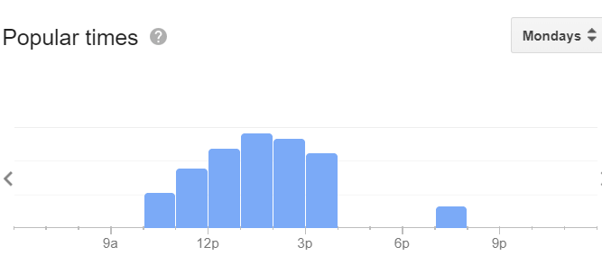

# REPO STRUCTURE

Below I have provided the details about my Repo

# Pre-Requisite Libraries

Numpy 
Selenium 
Pandas 
chromedriver.exe software 
Download link for chromedriver(http://chromedriver.chromium.org/downloads)

## Model_Accuracy.txt
Accuracy score of different regression used in training models 
Model accuracy of Simple Linear Regression: 77.22694587507564%  
Model accuracy of Polynomial Regression: 95.90858582599812% 
Model accuracy of Random Forest Regression: 86.78025951728222% 

## Scrapped_data.csv

Scrapped data of ortho specialist in Uttar Pradesh from the Google Search results: Ortho-Specialist name , Address , Ratings ,
Details of People visit was scrapped from histogram of Popular Times 
 
Frequency of People was calculated from height of each individual bar of histogram on a particular day

## Processed_Dataset.csv

Dataset pre processed for training model

## Scrapping_data.py

Python codes to scrap data from Google search results

## Processed_Dataset.py

Python codes to pre process data for training model

## Evaluating models.py

Python codes to evaluate accuracy of different Regressions used to train model

## model.py

I have used simple linear regression , polynomial linear regression & randomforest regression to train my model
First I have trained the model with above mentioned regression techniques on samples
Then I have used the trained model to predict the whole sample since sample datset was small
